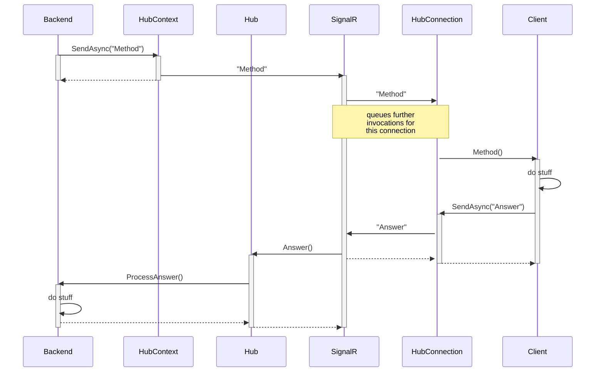

# Guaranteed SignalR Message Delivery

## Typed HubContext

* `IHubContext<SignalRHub, ISignalRClient> _typedHubContext;`
* **Advantage:** has a return value, can be used to determine success
* **Problem:** needs to run synchronously? Is blocking in the contract?
* `var result = await _typedHubContext.Clients.Group(...).SpecificMethod(...);`
* **Problem:** System.InvalidOperationException: InvokeAsync only works with Single clients.
* `var result = await _typedHubContext.Clients.Client(...).SpecificMethod(...);`
* **Problem:** Not easy to get connection id for single client

## HubContext Invoke(Core)Async

## Sequence Diagram

* [Hub Connection is locked!](https://github.com/dotnet/aspnetcore/blob/888c71f7f2269b6e67a24924cef66228857236f3/src/SignalR/server/Core/src/HubConnectionContext.cs#L341)

